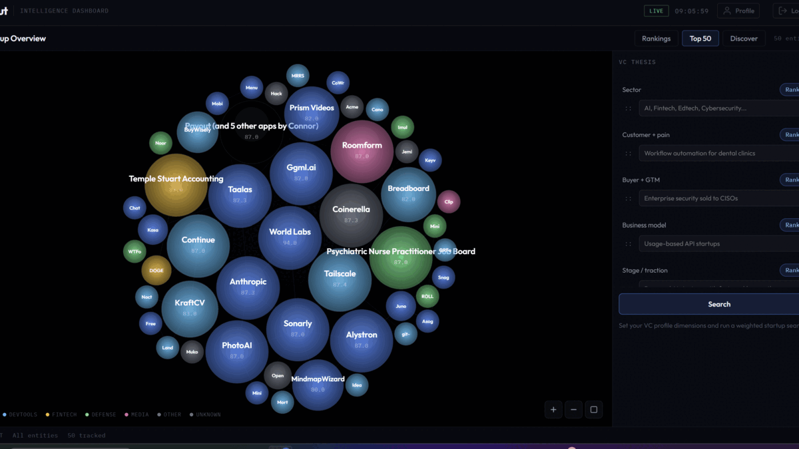
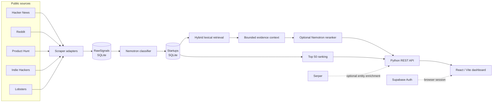

<div align="center">

# Scout

### Open-source startup signal intelligence for venture research.

Scout turns fragmented founder and developer discussion into a queryable company dataset: ingest source posts, classify startup signals, rank the resulting entities, and investigate the evidence behind each result.

[API reference](API.md) · [Local setup](#local-development) · [Architecture](#architecture) · [Devpost](https://devpost.com/software/scout-svtmd3)

🏆 **Winner: Best FinTech Track, 2026 Startup Week Buildathon**

</div>



> **Status: research prototype.** Scout is designed for product exploration and investor research workflows. It is not investment advice, and upstream data quality, coverage, and enrichment depend on external services.

## What Scout does

| Capability | Implementation | Output |
| --- | --- | --- |
| **Source ingestion** | Python adapters for Hacker News, Reddit, Product Hunt, Indie Hackers, and Lobsters | Normalized `RawSignals` rows with content, URL, engagement, and velocity |
| **Startup extraction** | Nemotron prompt extracts company metadata and a `scout_score` from a raw post | Canonical `Startups` records in SQLite |
| **Ranked discovery** | Top 50 query orders persisted companies by `scout_score`, then `first_seen` | Dashboard trend map and company ranking |
| **Thesis search** | Lexical candidate retrieval with optional Nemotron reranking against a weighted investor profile | Ranked niche-search results with source evidence |
| **Evidence drill-down** | Original scraped source plus optional Serper web enrichment | Entity graph nodes and links for research |

## Architecture



### Data paths

**Ingestion path**

```text
source post → RawSignals → evaluate_post() → Startups → refresh_top50()
```

Each scraper writes a source URL, raw text, upvotes, comments, and calculated engagement velocity to `RawSignals`. For a post with upvotes `u`, comments `c`, and age in hours `h`, the scraper records:

```math
v = \frac{u + c}{\max(1, h)}
```

`evaluate_post()` then classifies the post and, when it is a startup signal, produces structured company fields such as name, vertical, stage, traction, and `scout_score`. The classifier is instructed to score a company with a bounded novelty/depth term plus capped engagement priors:

```math
\operatorname{scout\_score} = \operatorname{idea}_{1..50} + \min(u, 30) + \min(2v, 20)
```

Repeated discoveries update the existing company and preserve the maximum score; the Top 50 is then rebuilt from `scout_score DESC, first_seen DESC`.

**Niche-search path**

```text
investor thesis + profile constraints → lexical retrieval → optional LLM rerank → final ranked results
```

## Retrieval-augmented ranking

Scout uses a lightweight, evidence-grounded RAG workflow for thesis search. It works directly from the SQLite company dataset and source text rather than a vector database, so every retrieved result can be traced back to a concrete record. The LLM sees a focused evidence set, not the entire corpus.

### Stage 1: hybrid lexical retrieval

The query is tokenized, expanded with domain aliases, and matched against an entity name, structured keywords, and source-node headline/summary text. For entity `e` and query terms `t`, the lexical score is:

```math
L(e,q) = 22I_q^{name} + 10I_q^{node} + \sum_{t \in q}(6I_t^{name} + 4I_t^{keyword} + 2I_t^{node}) + 0.08M + \min(10C, 8) + 0.5\min(N, 12)
```

Where `M` is persisted momentum (`scout_score`), `C` is confidence, `N` is the number of available evidence nodes, and `I` is a match indicator. A single-hit candidate is penalized by `0.65` to prefer multi-signal matches. Scout retains `max(5 × requested_limit, 40)` candidates before reranking.

### Stage 2: bounded RAG context and investor-profile reranking

For the top 16 candidates, Scout emits at most three evidence chunks per company: headline, summary, URL, source, and extracted keywords. The context is capped at 36 total chunks. Nemotron receives this context with the natural-language thesis, candidate metadata, and a weighted investor profile. Profile dimensions are rank-weighted linearly:

```math
w_i = \frac{m - r_i + 1}{\sum_{j=1}^{m}(m - r_j + 1)}
```

Here `r_i` is a user-assigned priority rank and `m` is the number of supported profile dimensions. The model returns inclusion, entity type, relevance, profile match, per-dimension match scores, and an evidence-grounded rationale.

### Stage 3: score fusion

Once the model responds, the final order is computed deterministically. Let `L̂` be lexical score normalized to 0–100, `R` be LLM relevance, `P` be LLM profile match, and `M` be momentum:

```math
S_{LLM} = 0.20L̂ + 0.40R + 0.30P + 0.10M
```

Without an LLM response, Scout falls back to:

```math
S_{lexical} = 0.70L̂ + 0.30M
```

Candidates explicitly excluded by the LLM receive a `0.5×` penalty. Candidates with no returned profile match are downranked instead of being assigned a made-up score.

## Runtime components

| Component | Entry point | Responsibility |
| --- | --- | --- |
| Web app | `frontend/src/main.jsx` | React routes, Supabase session handling, dashboard visualizations, REST polling |
| HTTP API | `backend/search_api.py` | JSON API for trends, entities, niche search, profiles, bookmarks, and source status |
| Ingestion worker | `backend/scraper.py` | Collects public-source posts, invokes classification, writes SQLite records, refreshes rankings |
| Niche engine | `backend/niche_search.py` | Query normalization, lexical retrieval, optional OpenRouter/Nemotron reranking |
| Persistence | `backend/db.py` | SQLite schema and startup/upsert/ranking helpers |

### SQLite state

| Table | Purpose | Key fields |
| --- | --- | --- |
| `RawSignals` | Unprocessed and processed source posts | `source_url` (unique), `post_content`, engagement, `processed` |
| `Startups` | Canonical extracted company records | `id`, `startup_name`, `vertical`, `stage`, `scout_score`, source evidence |
| `Top50Rankings` | Materialized ranking snapshot | `rank`, `startup_id` |
| `Profiles` | Investor profile metadata | `id`, thesis fields, firm, location |
| `Bookmarks` | User-saved companies | `user_id`, `entity_key` |

## Local development

### Requirements

- Node.js 18+
- Python 3.10+
- An OpenRouter API key only when running classification, score explanations, or LLM reranking

### Install

```bash
git clone https://github.com/parthsharma234/scout.git
cd scout
cp .env.example .env
npm install
python -m pip install -r backend/requirements.txt
```

On Windows PowerShell, use `Copy-Item .env.example .env`.

### Start the dashboard

Run these in separate terminals from the repository root:

```bash
# terminal 1: API on http://127.0.0.1:8000
npm run dev:api

# terminal 2: Vite on http://localhost:5173
npm run dev
```

Verify the API before opening the UI:

```bash
curl http://127.0.0.1:8000/api/health
curl http://127.0.0.1:8000/api/trends
```

### Run ingestion

The scraper is the real pipeline entry point. It requires `OPENROUTER_API_KEY` to classify collected posts; Product Hunt also requires `PRODUCT_HUNT`.

```bash
npm run pipeline:run
```

The pipeline writes raw signals, extracts qualifying companies, and refreshes the Top 50. It intentionally makes external network calls and can take time depending on source availability.

## Configuration

All configuration is read from the root `.env` file. Empty optional values disable their corresponding integration.

| Variable | Used by | Behavior |
| --- | --- | --- |
| `VITE_SUPABASE_URL`, `VITE_SUPABASE_ANON_KEY` | Frontend | Enables sign-in, profiles, and bookmarks. |
| `PRODUCT_HUNT` | Scraper | Enables Product Hunt GraphQL ingestion. |
| `OPENROUTER_API_KEY` | Classifier, search, API | Enables Nemotron extraction, score explanations, and reranking. |
| `OPENROUTER_MODEL` / `NEMOTRON_MODEL` | LLM calls | Overrides the default Nemotron model. |
| `GOOGLE_SERPER_KEY` | Entity nodes | Adds live web evidence to an entity graph. |
| `GOOGLE_CSE_API_KEY`, `GOOGLE_CSE_CX` | Enrichment | Alternative Google Custom Search credentials. |
| `SCOUT_AUTO_REBUILD_INDEX=1` | API startup | Writes a fresh search index at startup. |
| `SCOUT_ENABLE_SCHEDULER=1` | API startup | Enables the in-process scheduler hook. |
| `PIPELINE_RUN_UTC`, `PIPELINE_ENRICH_TOP_N`, `PIPELINE_BACKFILL_MONTHS` | Scheduler config | Sets pipeline defaults. |

## HTTP API

The API is served by Python's `ThreadingHTTPServer`; it is REST-only. The frontend attempts WebSocket updates when configured, but safely falls back to REST polling.

| Route | Query / body | Response focus |
| --- | --- | --- |
| `GET /api/health` | None | API and search-index status |
| `GET /api/trends` | None | Ranked entity payload for the map |
| `GET /api/sources` | None | Source health and ingestion counts |
| `GET /api/entity/{key}/nodes` | `include_enriched`, `limit` | Original source plus optional web evidence |
| `GET /api/entity/{key}/history` | `window_days` | Time-series entity history |
| `GET` / `POST /api/niche-search` | query, profile dimensions, rank priorities | Ranked thesis matches |
| `GET /api/pipeline/status` | None | Scheduler and recent pipeline metadata |
| `POST /api/user/profile` | profile fields + `X-User-ID` | Upserted investor profile |
| `GET` / `POST /api/user/bookmarks` | `user_id` or `entity_key` + `X-User-ID` | Saved-company list or toggle result |

### Niche-search example

```bash
curl -X POST http://127.0.0.1:8000/api/niche-search \
  -H "Content-Type: application/json" \
  -d '{
    "query": "workflow automation for dental clinics",
    "limit": 12,
    "min_score": 10,
    "use_nemotron": true,
    "enrich_on_demand": false,
    "query_profile": {
      "sector": "healthcare SaaS",
      "business_model": "B2B SaaS"
    },
    "dimension_priority_rank": {
      "sector": 1,
      "business_model": 2
    }
  }'
```

See [API.md](API.md) for the full route contract and request behavior.

## Repository map

```text
backend/
  scraper.py          # Source adapters and full ingestion pipeline
  search_api.py       # HTTP API server and dashboard adapters
  niche_search.py     # Retrieval and optional LLM reranking
  db.py               # SQLite schema and persistence helpers
frontend/
  src/pages/          # Landing, dashboard, and authenticated views
  src/components/     # Map, graph, ranking, and timeline components
data/
  scout.db            # Local seeded SQLite dataset
```

## Known limitations

- The full ingestion command is `npm run pipeline:run` / `backend/scraper.py`. The API's `POST /api/pipeline/run` currently reaches a prototype scheduler shim, so use the scraper command for real ingestion.
- Source access is best-effort: some sources can be rate-limited, unavailable, or require credentials.
- LLM classification and reranking are optional integrations; without `OPENROUTER_API_KEY`, the pipeline cannot classify new source posts and niche search uses lexical/momentum ranking only.
- The repository does not currently contain a maintained hosted deployment. Run Scout locally using the instructions above.

## Build

```bash
npm run build
```

The production frontend bundle is written to `frontend/dist`.
